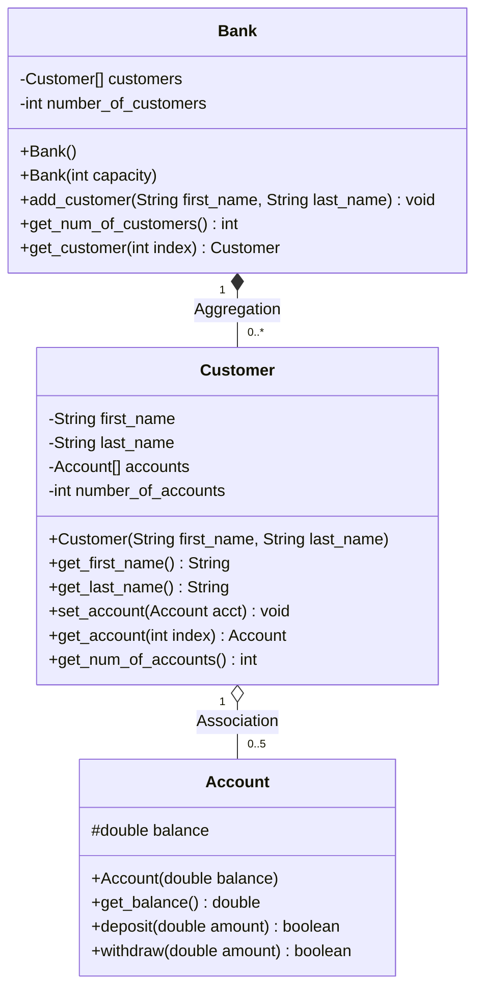

# Assignment 04: Array & ArrayList Exploration

## Overview

This module explores fixed-size arrays, dynamic collections (`ArrayList<T>`), 2D matrix representations, and object-oriented domain modeling via aggregation and association.

---

## File Manifest

| Source File | Description |
| :--- | :--- |
| `Country_Capital.java` | 2D rectangular matrix pairing 7 nations with their capital cities via column-wise traversal. |
| `Bank_Account.java` | Individual account entity encapsulating `balance` and `account_number`. |
| `Bank_Account_Array_In_Action.java` | Demonstration driver exercising dynamic `ArrayList` shifts, index insertions, and deletions. |
| `Account.java` | Core financial account entity with positive deposit validation and overdraft guard clauses. |
| `Customer.java` | Customer profile managing multiple financial accounts stored in a bounded fixed-size array (`Account[]`). |
| `Bank.java` | Aggregation root managing a directory of registered customer entities (`Customer[]`). |
| `Bank_Demo.java` | System driver providing automated test suite reporting and an interactive ATM console interface (`java.util.Scanner`). |

---

## Architecture & OOP Design Analysis



### 1. Fixed Array vs. Dynamic ArrayList
- **Fixed Array (`Account[] accounts`)**: Used in `Customer` and `Bank` where capacity boundaries are fixed and high cache locality with minimal memory overhead is prioritized.
- **Dynamic ArrayList (`ArrayList<Bank_Account>`)**: Demonstrated in `Bank_Account_Array_In_Action.java` to highlight automatic capacity expansion and positional shifting (`add(index, element)`, `remove(index)`).

### 2. Encapsulation and Data Protection
- Internal state fields (`balance`, `customers`, `accounts`, `number_of_customers`) are marked `private` / `protected`.
- Mutators enforce validation invariants: negative deposits and overdraft withdrawals return `false` without modifying account state.

---

## Compilation and Execution

```powershell
# Compile all sources
javac 04/*.java

# Run Country-Capital 2D matrix mapping
java -cp 04 Country_Capital

# Run dynamic ArrayList demonstration
java -cp 04 Bank_Account_Array_In_Action

# Run Banking System Driver (Automated Mode)
java -cp 04 Bank_Demo

# Run Banking System Driver (Interactive ATM Mode)
java -cp 04 Bank_Demo -i
```

---

## Terminal Execution Output

### Country-Capital Mapping (`Country_Capital`)
```
The capital of America is Washington
The capital of England is London
The capital of Japan is Tokyo
The capital of France is Paris
The capital of Indonesia is Jakarta
The capital of Iran is Tehran
The capital of Iraq is Baghdad
```

### Dynamic ArrayList In Action (`Bank_Account_Array_In_Action`)
```
Size: 3
Expected: 3
First account number: 1008
Expected: 1008
Last account number: 1729
Expected: 1729
```

### Banking System Audit Report (`Bank_Demo`)
```
==================================================
          BANK ACCOUNT MANAGEMENT SYSTEM          
==================================================

>>> Registering bank customers...
Total customers registered: 4

>>> Executing transaction cycles...
Customer [Jane Simms]
  Primary Initial balance : $500.0
  Withdraw $150.00        : balance = $350.0
  Deposit $22.50          : balance = $372.5

Customer [Owen Bryant]
  Initial balance         : $200.0
  Withdraw $300 (Attempt) : success = false, balance = $200.0
  Deposit $100.00         : balance = $300.0

==================================================
               BANK CUSTOMER REPORT               
==================================================
Customer [1] : Simms, Jane
  Account 1: Balance = $372.50
  Account 2: Balance = $1200.00
--------------------------------------------------
Customer [2] : Bryant, Owen
  Account 1: Balance = $300.00
--------------------------------------------------
Customer [3] : Soju, Tim
  Account 1: Balance = $1500.00
--------------------------------------------------
Customer [4] : Solev, Maria
  Account 1: Balance = $250.00
--------------------------------------------------
```
