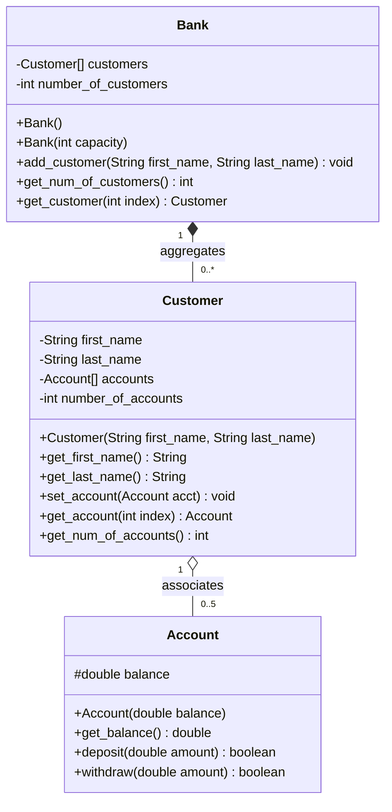

# Assignment 04: Arrays, ArrayLists, and Domain Aggregation

## Overview

This module covers fixed-size heap arrays, dynamic collections using `ArrayList<T>`, autoboxing/unboxing mechanisms, multidimensional matrices, and domain object modeling using aggregation and association.

---

## File Manifest

| File | Description |
| :--- | :--- |
| `Country_Capital.java` | 2D rectangular matrix pairing 7 nations with their capital cities using column-wise iteration. |
| `Bank_Account.java` | Individual bank account state model managing balance and account identification. |
| `Bank_Account_Array_In_Action.java` | Demonstration driver exercising dynamic `ArrayList` shifts, index insertions, and deletions. |
| `Account.java` | Core financial account entity with positive deposit validation and overdraft guard clauses. |
| `Customer.java` | Customer profile managing multiple financial accounts stored in a bounded fixed-size array (`Account[]`). |
| `Bank.java` | Aggregation root managing a directory of registered customer entities (`Customer[]`). |
| `Bank_Demo.java` | Integrated system validation harness testing customer creation, multi-account routing, deposits, overdraft rejections, and customer portfolio reports. |

---

## Architecture and Domain Model



---

## Compilation and Execution

```powershell
# Compile all sources in this directory
javac 04/*.java

# Run Country-Capital matrix exercise
java -cp 04 Country_Capital

# Run ArrayList dynamic operations harness
java -cp 04 Bank_Account_Array_In_Action

# Run core banking system simulation
java -cp 04 Bank_Demo
```
