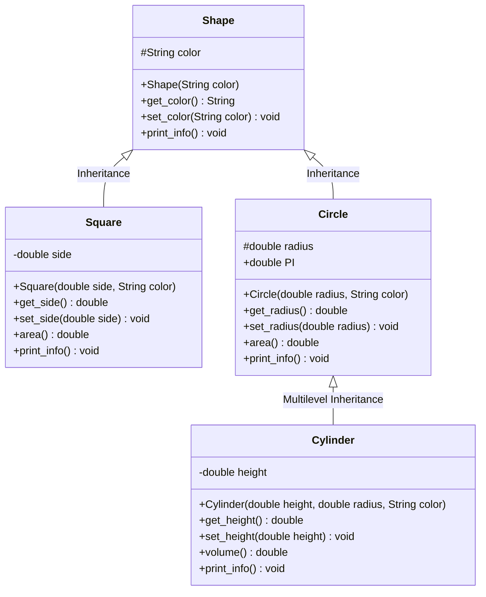

# Assignment 05: Abstraction, Encapsulation, Inheritance, and Polymorphism

## Overview

This module demonstrates the four pillars of Object-Oriented Programming (OOP) in Java:
- **Abstraction**: Modeling essential geometric entities and separating functional contracts from underlying mathematical formulas.
- **Encapsulation**: Guarding internal fields (`color`, `side`, `radius`, `height`) using `private` and `protected` access levels with validated mutators.
- **Inheritance**: Constructing subtyping trees with constructor delegation via `super()`.
- **Polymorphism**: 
  - **Compile-Time Polymorphism (Method Overloading)**: Multi-signature arithmetic operations in `Mathematics` and `Advanced_Mathematics`.
  - **Run-Time Polymorphism (Method Overriding & Dynamic Dispatch)**: Traversal of heterogeneous `Shape[]` arrays invoking overridden `print_info()` methods.

---

## Code Architecture & OOP Pillars Breakdown



### 1. Where Encapsulation is Implemented
- In `Square.java`, `side` is declared `private` to prevent external arbitrary writes. The setter `set_side(double side)` enforces a positivity invariant guard (`side > 0`).
- In `Shape.java` and `Circle.java`, fields `color` and `radius` are marked `protected` so derived classes (`Square`, `Circle`, `Cylinder`) can access necessary state while remaining shielded from unrelated external packages.

### 2. Where Inheritance is Implemented
- **Single Inheritance**: `Square extends Shape` and `Circle extends Shape`. `Square` and `Circle` inherit the `color` property and getter/setter methods from `Shape`.
- **Multilevel Inheritance**: `Cylinder extends Circle` (which in turn extends `Shape`). `Cylinder` inherits `radius` from `Circle` and `color` from `Shape`.
- **Constructor Delegation (`super()`)**: Every subclass delegates state initialization to its immediate parent:
  ```java
  public Cylinder(double height, double radius, String color){
      super(radius, color); // Line 1: Circle and Shape construct their state
      this.height = height; // Child initializes its specific field
  }
  ```

### 3. Where Polymorphism is Implemented
- **Run-Time Polymorphism (Method Overriding)**:
  - `print_info()` is defined in `Shape` and overridden in `Square`, `Circle`, and `Cylinder`.
  - In `Shape_Demo.java`, an array `Shape[] shape_roster` holds `Square`, `Circle`, and `Cylinder` instances. When calling `shape_roster[i].print_info()`, the JVM dynamically resolves the exact concrete class implementation via the virtual method table (vtable).
- **Compile-Time Polymorphism (Method Overloading)**:
  - In `Mathematics.java` and `Advanced_Mathematics.java`, the `add`, `subtract`, `multiply`, `divide`, and `modulus` methods are overloaded to accept either 2 or 3 parameters of type `int` or `double`. The compiler binds the correct method at compile time based on parameter signatures.

---

## File Manifest

| Source File | Role | OOP Principle Highlighted |
| :--- | :--- | :--- |
| `Shape.java` | Base Class | Abstraction & Root Encapsulation |
| `Square.java` | Subclass of `Shape` | Inheritance & Method Overriding |
| `Circle.java` | Subclass of `Shape` | Inheritance & Constant Encapsulation (`PI`) |
| `Cylinder.java` | Subclass of `Circle` | Multilevel Inheritance & Code Reuse (`volume = area() * height`) |
| `Shape_Demo.java` | Test Harness | Run-Time Polymorphism & Interactive CLI Inspector |
| `Mathematics.java` | Base Arithmetic Engine | Compile-Time Method Overloading (2 parameters) |
| `Advanced_Mathematics.java` | Extended Engine | Compile-Time Method Overloading (3 parameters) |
| `Math_Demo.java` | Test Harness | Method Overloading Verification |

---

## Compilation and Execution

```powershell
# Compile all sources
javac 05/*.java

# Run Geometric Shape Demo (Automated Mode)
java -cp 05 Shape_Demo

# Run Geometric Shape Demo (Interactive Inspector Mode)
java -cp 05 Shape_Demo -i

# Run Arithmetic Overloading Demo
java -cp 05 Math_Demo
```

---

## Terminal Execution Output

### Geometric Shape Hierarchy & Polymorphism (`Shape_Demo`)
```
==================================================
         GEOMETRIC SHAPE HIERARCHY DEMO           
==================================================

--- Direct Invocations ---
Square colored red, area = 100.0
Circle blue, area = 153.93804002589985
Cylinder green, volume = 2309.070600388498

--- Polymorphic Array Traversal ---
[0] Square colored yellow, area = 25.0
[1] Circle cyan, area = 50.26548245743669
[2] Cylinder magenta, volume = 502.6548245743669
==================================================
```

### Method Overloading Suite (`Math_Demo`)
```
==================================================
       METHOD OVERLOADING DEMONSTRATION           
==================================================

--- Addition Overloading Suite ---
add(12.5, 28.7, 14.2) = 55.400000000000006
add(12, 28, 14)       = 54
add(23, 34)           = 57
add(3.4, 4.9)         = 8.3

--- Extended Operations Suite ---
subtract(50.0, 15.5, 4.5) = 30.0
multiply(2.5, 4.0, 3.0)   = 30.0
divide(100.0, 2.0, 5.0)   = 10.0
modulus(100, 15, 4)       = 2
==================================================
```
