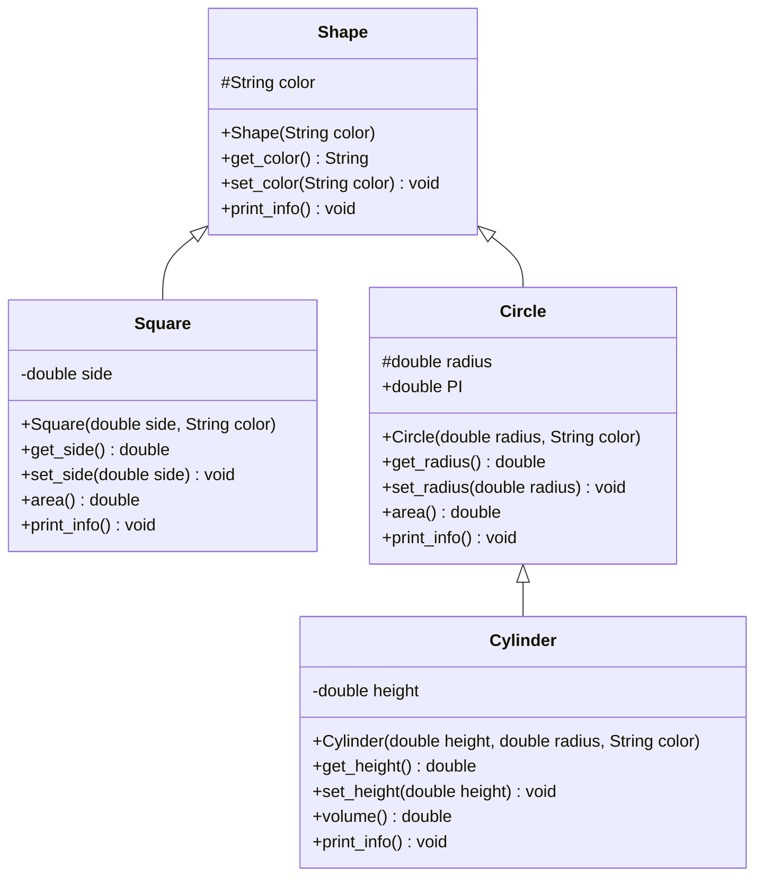

# Assignment 05: Abstraction, Encapsulation, Inheritance, and Polymorphism

## Overview

This module covers the core pillars of object-oriented design in Java:
1. **Abstraction**: Modeling essential domain state and separating interface from implementation.
2. **Encapsulation**: Guarding internal fields via access modifiers (`private`, `protected`) and class invariants.
3. **Inheritance**: Establishing subtyping hierarchies with explicit constructor delegation (`super()`).
4. **Polymorphism**: 
   - Compile-Time / Static Binding: Method overloading across signatures.
   - Run-Time / Dynamic Binding: Virtual method table (vtable) dispatch across inherited subclasses.

---

## File Manifest

### Geometric Hierarchy (Inheritance & Runtime Polymorphism)

| File | Description |
| :--- | :--- |
| `Shape.java` | Base geometric shape entity defining color state and visual printing interface. |
| `Square.java` | Subclass of `Shape` calculating square area from side length. |
| `Circle.java` | Subclass of `Shape` calculating circular area using statutory `PI`. |
| `Cylinder.java` | Subclass of `Circle` calculating 3D volume by reusing inherited `Circle.area()`. |
| `Shape_Demo.java` | Test harness demonstrating constructor chaining, subclass invocations, and dynamic dispatch across a heterogeneous `Shape[]` array. |

### Arithmetic Engine (Compile-Time Method Overloading)

| File | Description |
| :--- | :--- |
| `Mathematics.java` | Base arithmetic engine overloading 2-parameter operations (`add`, `subtract`, `multiply`, `divide`, `modulus`) for `int` and `double`. |
| `Advanced_Mathematics.java` | Subclass extending `Mathematics` with overloaded 3-parameter arithmetic operations for `int` and `double`. |
| `Math_Demo.java` | Test harness executing overloaded arithmetic methods with multiple argument types and arities. |

---

## Architecture and Class Diagrams



---

## Compilation and Execution

```powershell
# Compile all sources in this directory
javac 05/*.java

# Run Geometric Shape inheritance and polymorphism driver
java -cp 05 Shape_Demo

# Run Arithmetic method overloading driver
java -cp 05 Math_Demo
```
